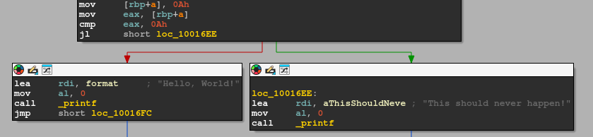
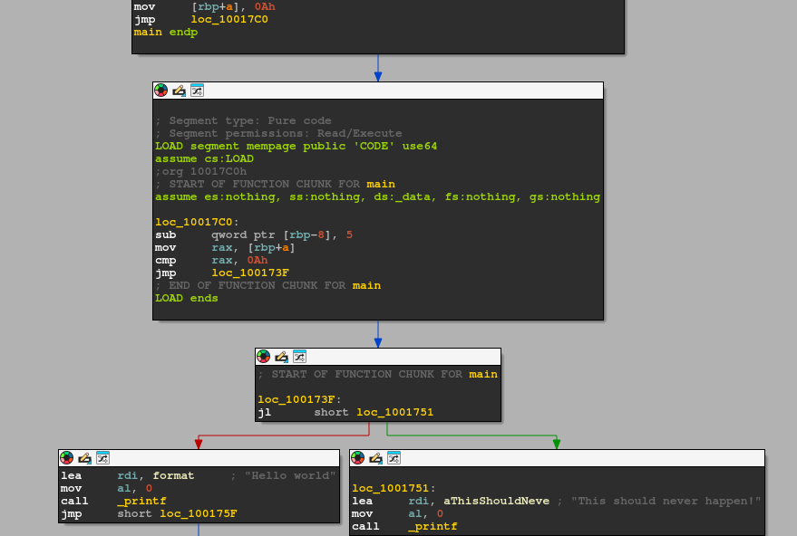

BinModify Plugin
================

Bin(ary) Mod(ify) is a lightweight tool for patching binary executables, this is a plugin for using binmodify from ida.

Features:

- Inserting inline hooks (Shift+I).

This allowes for writing to binary files as though they were textual files! Inserting extra code inbetween existing instructions.

Installation
============

run `zig build -Doptimize=ReleaseSafe -Didasdk=<ida-sdk-path>`.

copy (or link) `zig-out/lib/libbinmodify.so` into the ida plugins directory (`~/.idapro/plugins/` on linux).

Usage
=====

* Locate the place where you want to insert your hook.

* Click `Shift+I`, you will be prompted for which bytes you would like to insert.

